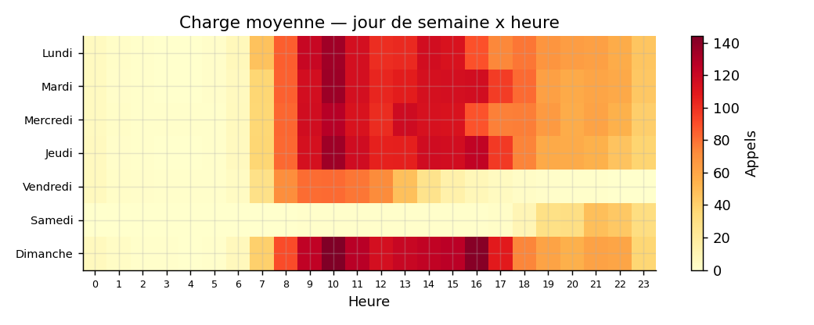
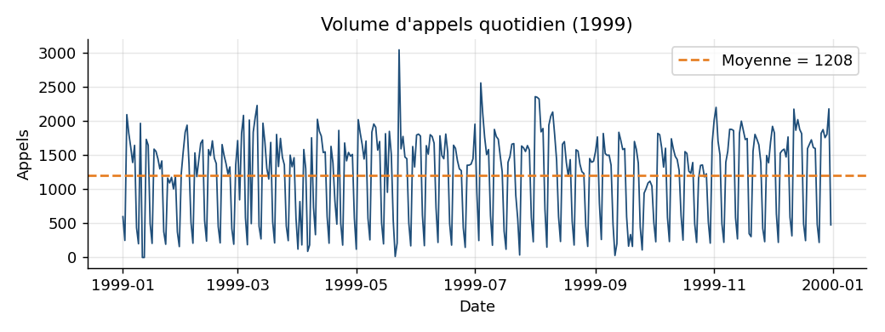
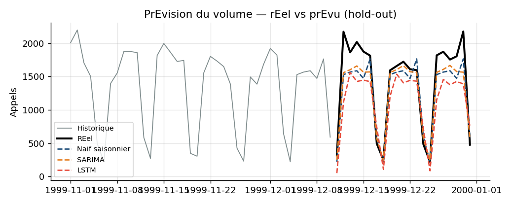
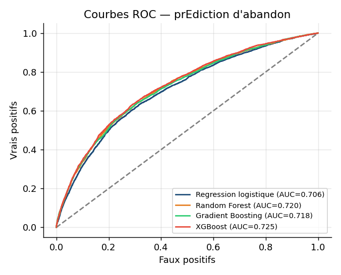
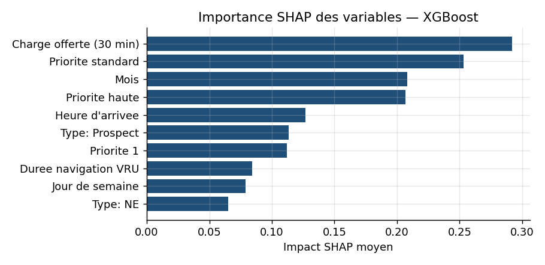
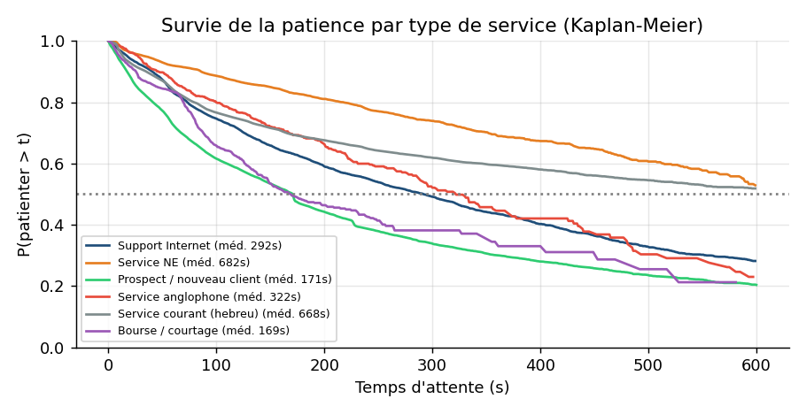
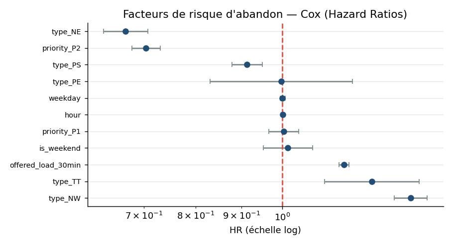
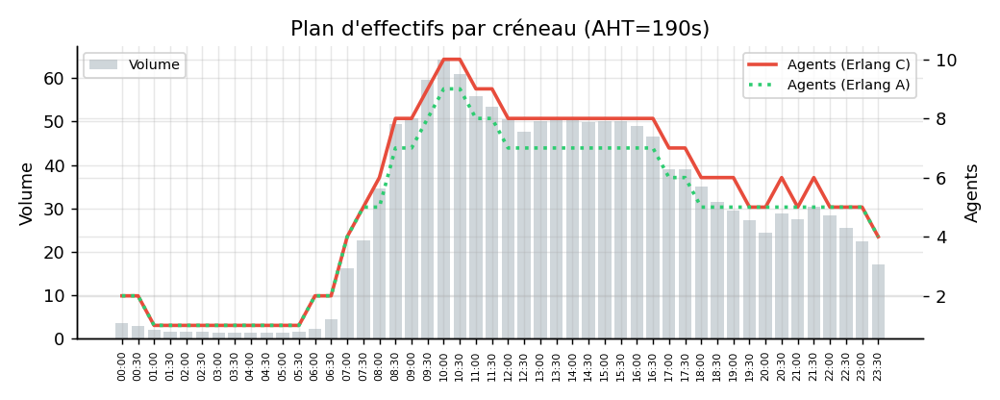

# 📞 L'apport de la Business Intelligence dans l'optimisation de la gestion des centres d'appels

> **Mémoire de Master 2 — Université Cheikh Anta Diop (UCAD), Dakar**
> Faculté des Sciences et Techniques · Département de Mathématiques-Informatique
> Master en Informatique — Spécialité **Business Intelligence** · Année universitaire 2022-2023


Application décisionnelle complète — **Business Intelligence + Machine Learning** — pour
**optimiser la planification des effectifs** d'un centre de relation client bancaire par la
prévision du volume d'appels, l'analyse de la performance des agents et la prévention des
abandons. Le projet s'appuie sur le corpus réel **AnonymousBank** (≈ 444 000 appels, 1999).

### 🚀 [**Voir la démo en ligne (Streamlit)**](https://cheikh-sall1492.streamlit.app/)

---

## 🎯 Objectifs

1. **Optimisation de la planification des effectifs** — prévoir le volume d'appels (jour et
   créneau de 30 min) et traduire la charge en nombre d'agents requis (théorie des files / Erlang).
2. **Amélioration de la performance des agents** — KPI individuels (AHT, productivité…),
   segmentation et facteurs explicatifs.
3. **Prévention des abandons** — modèle prédictif de l'abandon d'appel et analyse de la
   patience client (survie).

---

## 🧩 Modules de l'application

| Module | Méthodes | Objectif |
|--------|----------|----------|
| 📊 **Vue exécutive** | KPI, heatmap de charge, profils intra-journaliers | Pilotage global |
| 📈 **Prévision du volume** | Naïf saisonnier · **SARIMA** · Prophet · **LSTM** | Anticipation de la demande |
| 🧑‍💼 **Performance des agents** | KPI + segmentation **K-means** | Évaluation & coaching |
| 🚨 **Prédiction de l'abandon** | Régression logistique · Random Forest · Gradient Boosting · **XGBoost** + **SHAP** | Alerte précoce |
| ⏳ **Survie de la patience** | **Kaplan-Meier** + **Cox** | Quand le client abandonne |
| 👥 **Dimensionnement** | **Erlang C / Erlang A** | Effectifs requis par créneau |

---

## 🏗️ Architecture

```
Source CSV  →  ETL (nettoyage, typage, feature engineering)  →  Entrepôt (schéma en étoile)
            →  Data Marts  →  Tableaux de bord (Streamlit)
                                      │
                                      └─ Couche analytique (Machine Learning) :
                                         prévision · classification · survie · dimensionnement
```

Méthodologie : **CRISP-DM**. Théorie sous-jacente : files d'attente (Erlang-C/A),
prévision de séries temporelles (Box-Jenkins, deep learning), apprentissage supervisé,
analyse de survie.

---

## 📊 Résultats clés (sur les données réelles)

- **444 436 appels** valides analysés (année 1999), **taux d'abandon ≈ 19,9 %**, 53 agents.
- **Niveau de service réel ≈ 43,6 %** (cible 80 %) → sous-dimensionnement structurel aux pics.
- **Prévision** : SARIMA (MAPE ≈ 12,6 %) > naïf saisonnier (≈ 14,9 %) > LSTM (≈ 16,7 %).
  *Résultat conforme à la littérature : les méthodes statistiques surpassent le deep learning
  sur des séries courtes (compétitions M de Makridakis).*
- **Abandon** : XGBoost meilleur (**AUC-ROC ≈ 0,72**) ; la **congestion du créneau** est le
  déterminant dominant (analyse SHAP).
- **Patience** : médiane des abandons ≈ 51 s ; les **prospects** sont les moins patients
  (médiane ≈ 171 s) vs service courant (≈ 668 s).

---

## 🖼️ Galerie des analyses

> Visualisations produites par l'application à partir des données réelles.

**Charge & demande**
<p align="center">
  
  
</p>

**Prévision du volume (SARIMA · LSTM · naïf)**
<p align="center">
  
</p>

**Prédiction de l'abandon — ROC & interprétabilité SHAP**
<p align="center">
  
  
</p>

**Survie de la patience (Kaplan-Meier) & facteurs de risque (Cox)**
<p align="center">
  
  
</p>

**Dimensionnement des effectifs (Erlang C / A)**
<p align="center">
  
</p>

---

## ⚙️ Installation & lancement

### Prérequis
- Python 3.8+ · (Node.js 18+ uniquement pour régénérer le rapport Word)

### Installation
```bash
cd app
pip install -r requirements.txt
```

### Lancement
```bash
cd app
streamlit run app.py
```
L'application s'ouvre sur **http://localhost:8501**. Le premier chargement nettoie les données
et crée un cache (`app/_cache/`) ; les lancements suivants sont instantanés.

> **Sous Windows**, si `python`/`streamlit` ne sont pas dans le PATH, utilisez le chemin
> complet, par ex. : `& "C:\Users\<vous>\AppData\Local\Programs\Python\Python38\python.exe" -m streamlit run app.py`

---

## 📂 Données

Le corpus **AnonymousBank** (centre d'appel bancaire israélien, 1999 — projet *DataMOCCA*,
Technion SEELab) n'est **pas versionné** (≈ 46 Mo). Pour exécuter l'application :

1. Récupérez le fichier `Annee1999.csv` (format TSV, 17 colonnes).
2. Placez-le **à la racine du projet** (à côté du dossier `app/`).

Le chemin est configurable dans [`app/src/config.py`](app/src/config.py) (`DATA_RAW`).

---

## 🗂️ Structure du projet

```
.
├── app/
│   ├── app.py                  # Page d'accueil
│   ├── pages/                  # 6 modules (vue exécutive, prévision, agents, abandon, survie, dimensionnement)
│   ├── src/                    # etl · kpi · forecasting · abandonment · agents · staffing · survival · ui · config
│   ├── report/                 # Génération du rapport Word + figures
│   │   ├── make_figures.py     #   → figures (PNG) + chiffres (results.json)
│   │   ├── build_report.js     #   → assemble le .docx
│   │   └── Rapport_Chapitres_III_IV.docx
│   ├── requirements.txt
│   └── run.ps1                 # Lanceur Windows
├── Annee1999.csv               # (non versionné — à ajouter)
├── LICENSE
└── README.md
```

---

## 📄 Rapport

Un rapport Word (chapitres **Implémentation** et **Résultats**) est généré automatiquement à
partir des données réelles : [`app/report/Rapport_Chapitres_III_IV.docx`](app/report/Rapport_Chapitres_III_IV.docx).
Pour le régénérer :
```powershell
cd app\report
.\make_report.ps1
```

---

## 🛠️ Stack technique

`Python` · `pandas` · `scikit-learn` · `XGBoost` · `statsmodels` (SARIMA) · `TensorFlow/Keras`
(LSTM) · `lifelines` (survie) · `SHAP` (interprétabilité) · `Streamlit` · `Plotly`.

---

## 🎓 Encadrement & jury (UCAD, soutenu le 08 juin)

- **Auteur** : Cheikh Sall
- **Encadrant** : Mamadou THIONGANE (Maître-Assistant, UCAD)
- **Superviseur** : Aliou BOLY (Professeur, UCAD)
- **Président du jury** : Samba NDIAYE (Professeur, UCAD)
- **Membres** : Modou GUEYE · Djamal SECK · Ndiouma BAME (UCAD)

---

## 📚 Références principales

- Brown, L. et al. (2005). *Statistical Analysis of a Telephone Call Center*. **JASA**.
- Gans, N., Koole, G., Mandelbaum, A. (2003). *Telephone Call Centers: Tutorial, Review and Research Prospects*. **M&SOM**.
- Chen, T. & Guestrin, C. (2016). *XGBoost: A Scalable Tree Boosting System*. **KDD**.
- Lundberg, S. & Lee, S. (2017). *A Unified Approach to Interpreting Model Predictions (SHAP)*. **NeurIPS**.
- Hyndman, R. & Athanasopoulos, G. (2021). *Forecasting: Principles and Practice (FPP3)*.

---

## 📝 Licence

Distribué sous licence **MIT** — voir [LICENSE](LICENSE). © 2023 Cheikh Sall.
